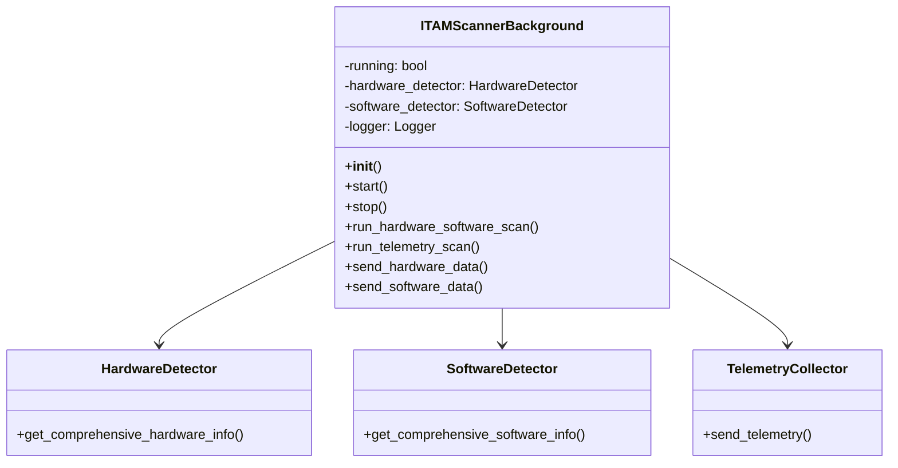

# ITAM Scanner Background Service - Technical Specification

## System Overview

The ITAM Scanner Background Service is a Windows-based background process designed for continuous IT asset monitoring without user interaction. It operates as a standalone executable with no console window, making it ideal for production deployments.

## Technical Architecture

### Core Components

```
ITAMScannerBackground
├── Configuration Management
│   ├── Environment Variables
│   ├── Config File Parser
│   └── Default Values
├── Detection Modules
│   ├── HardwareDetector
│   ├── SoftwareDetector
│   └── TelemetryCollector
├── Scheduling System
│   ├── Hardware/Software Scan (60min)
│   ├── Telemetry Scan (10min)
│   └── Task Queue Management
├── Logging System
│   ├── File Handler
│   ├── Log Rotation
│   └── Error Tracking
└── Signal Handling
    ├── SIGINT Handler
    ├── SIGTERM Handler
    └── Graceful Shutdown
```

### Class Diagram



## Implementation Details

### Configuration System

#### Environment Variable Loading
```python
def load_configuration():
    """Load configuration with priority order."""
    # 1. Environment variables (highest priority)
    tenant_id = os.getenv('TENANT_ID', 'default')
    api_token = os.getenv('API_TOKEN', '')
    api_base_url = os.getenv('API_BASE_URL', 'http://localhost:3000/api')
    
    # 2. Config file (if exists)
    config_file = os.path.join(os.path.dirname(__file__), 'config.env')
    if os.path.exists(config_file):
        load_config_file(config_file)
    
    # 3. Default values (lowest priority)
    return {
        'TENANT_ID': tenant_id,
        'API_TOKEN': api_token,
        'API_BASE_URL': api_base_url
    }
```

#### Config File Parser
```python
def load_config_file(file_path):
    """Parse config.env file and set environment variables."""
    with open(file_path, 'r') as f:
        for line in f:
            line = line.strip()
            if line and not line.startswith('#') and '=' in line:
                key, value = line.split('=', 1)
                os.environ[key.strip()] = value.strip()
```

### Scheduling System

#### Task Scheduling
```python
def setup_scheduling():
    """Configure scheduled tasks."""
    # Hardware and software scan every 60 minutes
    schedule.every(HARDWARE_SOFTWARE_INTERVAL).minutes.do(
        self.run_hardware_software_scan
    )
    
    # Telemetry scan every 10 minutes
    schedule.every(TELEMETRY_INTERVAL).minutes.do(
        self.run_telemetry_scan
    )
```

#### Main Loop
```python
def main_loop(self):
    """Main service loop with signal handling."""
    while self.running:
        # Check for stop signal
        if self.should_stop:
            break
        
        # Run scheduled tasks
        schedule.run_pending()
        
        # Sleep for 1 second to prevent high CPU usage
        time.sleep(1)
```

### Logging System

#### Log Configuration
```python
def setup_logging(self):
    """Configure logging system."""
    log_dir = os.path.join(os.path.dirname(__file__), 'logs')
    if not os.path.exists(log_dir):
        os.makedirs(log_dir)
    
    log_file = os.path.join(log_dir, 'itam_scanner_background.log')
    
    logging.basicConfig(
        level=logging.INFO,
        format='%(asctime)s - %(levelname)s - %(message)s',
        handlers=[logging.FileHandler(log_file)]
    )
    
    self.logger = logging.getLogger(__name__)
```

#### Log Message Format
```
2025-01-18 10:30:15,123 - INFO - ITAM Scanner Background initialized for tenant: tenant_123
2025-01-18 10:30:15,124 - INFO - API Base URL: http://localhost:3000/api
2025-01-18 10:30:15,125 - INFO - Starting ITAM Scanner Background...
```

### Signal Handling

#### Signal Handlers
```python
def setup_signal_handlers(self):
    """Setup signal handlers for graceful shutdown."""
    signal.signal(signal.SIGINT, self.signal_handler)
    signal.signal(signal.SIGTERM, self.signal_handler)

def signal_handler(self, signum, frame):
    """Handle system signals."""
    self.logger.info(f"Received signal {signum}, shutting down gracefully...")
    self.stop()
    sys.exit(0)
```

### Console Window Management

#### Hide Console Window
```python
def hide_console():
    """Hide console window on Windows."""
    try:
        import ctypes
        from ctypes import wintypes
        
        kernel32 = ctypes.windll.kernel32
        user32 = ctypes.windll.user32
        
        console_window = kernel32.GetConsoleWindow()
        if console_window:
            user32.ShowWindow(console_window, 0)  # SW_HIDE = 0
    except:
        pass  # Ignore errors on non-Windows systems
```

## API Integration

### Hardware Data Transmission
```python
def send_hardware_data(self, hardware_data):
    """Send hardware data to API with change detection."""
    try:
        from hardware import send_hardware_data as send_with_changes
        success = send_with_changes(hardware_data, self.API_BASE_URL)
        return {
            "success": success,
            "status_code": 200 if success else 500,
            "response": "Hardware data processed with change detection"
        }
    except Exception as e:
        return {"success": False, "error": str(e)}
```

### Software Data Transmission
```python
def send_software_data(self, software_data):
    """Send software data to API."""
    try:
        headers = {'Authorization': f'Bearer {self.API_TOKEN}'}
        response = requests.post(
            f"{self.API_BASE_URL}/software", 
            json=software_data, 
            headers=headers, 
            timeout=30
        )
        return {
            "success": response.status_code == 200,
            "status_code": response.status_code,
            "response": response.json() if 'application/json' in response.headers.get('Content-Type', '') else response.text
        }
    except Exception as e:
        return {"success": False, "error": str(e)}
```

### Telemetry Transmission
```python
def run_telemetry_scan(self):
    """Run telemetry scan."""
    try:
        telemetry_result = send_telemetry(f"{self.API_BASE_URL}/telemetry")
        
        if telemetry_result['success']:
            self.logger.info("Telemetry scan completed successfully")
        else:
            self.logger.error(f"Telemetry scan failed: {telemetry_result.get('error', 'Unknown error')}")
            
    except Exception as e:
        self.logger.error(f"Error during telemetry scan: {e}")
```

## Error Handling

### Exception Handling Strategy
```python
def run_hardware_software_scan(self):
    """Run hardware and software scans with error handling."""
    try:
        # Hardware scan
        self.logger.info("Running hardware scan...")
        hardware_data = self.hardware_detector.get_comprehensive_hardware_info()
        hardware_result = self.send_hardware_data(hardware_data)
        
        if hardware_result['success']:
            self.logger.info("Hardware scan completed successfully")
        else:
            self.logger.error(f"Hardware scan failed: {hardware_result.get('error', 'Unknown error')}")
        
        # Software scan
        self.logger.info("Running software scan...")
        software_data = self.software_detector.get_comprehensive_software_info()
        software_result = self.send_software_data(software_data)
        
        if software_result['success']:
            self.logger.info("Software scan completed successfully")
        else:
            self.logger.error(f"Software scan failed: {software_result.get('error', 'Unknown error')}")
            
    except Exception as e:
        self.logger.error(f"Error during hardware/software scan: {e}")
```

### Retry Logic
```python
def send_with_retry(self, data, endpoint, max_retries=3):
    """Send data with retry logic."""
    for attempt in range(max_retries):
        try:
            response = requests.post(endpoint, json=data, timeout=30)
            if response.status_code == 200:
                return {"success": True, "response": response.json()}
        except Exception as e:
            if attempt == max_retries - 1:
                return {"success": False, "error": str(e)}
            time.sleep(2 ** attempt)  # Exponential backoff
```

## Performance Considerations

### Memory Management
```python
def cleanup_resources(self):
    """Clean up resources to prevent memory leaks."""
    # Clear scheduled tasks
    schedule.clear()
    
    # Close file handles
    for handler in self.logger.handlers:
        handler.close()
    
    # Clear large data structures
    self.hardware_data = None
    self.software_data = None
```

### CPU Optimization
```python
def optimized_main_loop(self):
    """Optimized main loop with adaptive sleep."""
    sleep_time = 1  # Start with 1 second
    
    while self.running:
        start_time = time.time()
        
        # Run scheduled tasks
        schedule.run_pending()
        
        # Calculate sleep time based on activity
        elapsed = time.time() - start_time
        if elapsed > 0.1:  # If we spent more than 100ms
            sleep_time = min(sleep_time * 1.1, 5)  # Increase sleep time
        else:
            sleep_time = max(sleep_time * 0.9, 0.1)  # Decrease sleep time
        
        time.sleep(sleep_time)
```

## Security Implementation

### API Token Security
```python
def secure_api_call(self, endpoint, data):
    """Make secure API call with token validation."""
    if not self.API_TOKEN:
        self.logger.error("API token not configured")
        return {"success": False, "error": "No API token"}
    
    headers = {
        'Authorization': f'Bearer {self.API_TOKEN}',
        'Content-Type': 'application/json',
        'User-Agent': 'ITAM-Scanner-Background/1.0'
    }
    
    try:
        response = requests.post(endpoint, json=data, headers=headers, timeout=30)
        return {"success": response.status_code == 200, "response": response}
    except Exception as e:
        self.logger.error(f"API call failed: {e}")
        return {"success": False, "error": str(e)}
```

### Input Validation
```python
def validate_configuration(self):
    """Validate configuration before starting."""
    if not self.TENANT_ID or self.TENANT_ID == 'default':
        self.logger.warning("TENANT_ID not configured, using default")
    
    if not self.API_TOKEN:
        self.logger.error("API_TOKEN not configured")
        return False
    
    if not self.API_BASE_URL or not self.API_BASE_URL.startswith('http'):
        self.logger.error("API_BASE_URL not configured or invalid")
        return False
    
    return True
```

## Testing Framework

### Unit Tests
```python
import unittest
from unittest.mock import Mock, patch

class TestITAMScannerBackground(unittest.TestCase):
    def setUp(self):
        self.scanner = ITAMScannerBackground()
    
    def test_configuration_loading(self):
        """Test configuration loading."""
        with patch.dict(os.environ, {'TENANT_ID': 'test_tenant'}):
            scanner = ITAMScannerBackground()
            self.assertEqual(scanner.TENANT_ID, 'test_tenant')
    
    def test_signal_handling(self):
        """Test signal handling."""
        with patch('signal.signal') as mock_signal:
            self.scanner.setup_signal_handlers()
            mock_signal.assert_called()
    
    @patch('requests.post')
    def test_api_call(self, mock_post):
        """Test API call functionality."""
        mock_post.return_value.status_code = 200
        result = self.scanner.send_software_data({'test': 'data'})
        self.assertTrue(result['success'])
```

### Integration Tests
```python
def test_full_scan_cycle(self):
    """Test complete scan cycle."""
    scanner = ITAMScannerBackground()
    
    # Mock hardware and software detectors
    scanner.hardware_detector = Mock()
    scanner.software_detector = Mock()
    
    # Run scan
    scanner.run_hardware_software_scan()
    
    # Verify detectors were called
    scanner.hardware_detector.get_comprehensive_hardware_info.assert_called_once()
    scanner.software_detector.get_comprehensive_software_info.assert_called_once()
```

## Deployment Specifications

### System Requirements
- **OS**: Windows 10/11 (64-bit)
- **Memory**: 100MB minimum, 500MB recommended
- **Disk**: 50MB for executable, 100MB for logs
- **Network**: Internet connectivity for API calls
- **Permissions**: Administrator recommended

### Build Configuration
```python
# PyInstaller configuration
pyinstaller_config = {
    'onefile': True,
    'noconsole': True,
    'name': 'ITAM_Scanner_Background',
    'add_data': [
        'hardware.py;.',
        'software.py;.',
        'telemetry.py;.',
        'utils.py;.'
    ],
    'hidden_imports': [
        'schedule',
        'requests',
        'psutil',
        'GPUtil'
    ]
}
```

### Installation Package
```
ITAM_Scanner_[tenant_id].zip
├── ITAM_Scanner.exe                    # Console version
├── ITAM_Scanner_Background.exe         # Background version
├── config.env                          # Configuration
└── install_scanner.bat                 # Installer script
```

## Monitoring and Metrics

### Health Check Endpoint
```python
def health_check(self):
    """Return service health status."""
    return {
        "status": "healthy" if self.running else "stopped",
        "uptime": time.time() - self.start_time,
        "last_hardware_scan": self.last_hardware_scan,
        "last_software_scan": self.last_software_scan,
        "last_telemetry_scan": self.last_telemetry_scan,
        "scan_count": self.scan_count,
        "error_count": self.error_count
    }
```

### Metrics Collection
```python
def collect_metrics(self):
    """Collect service metrics."""
    return {
        "scans_completed": self.scan_count,
        "errors": self.error_count,
        "uptime_seconds": time.time() - self.start_time,
        "memory_usage": self.get_memory_usage(),
        "cpu_usage": self.get_cpu_usage()
    }
```

## Version History

### v1.0.0 (2025-01-18)
- Initial release
- Background execution support
- Console window hiding
- Signal handling
- Comprehensive logging
- API integration
- Configuration management

---

**Document Version**: 1.0.0  
**Last Updated**: January 18, 2025  
**Compatibility**: Windows 10/11 (64-bit)
